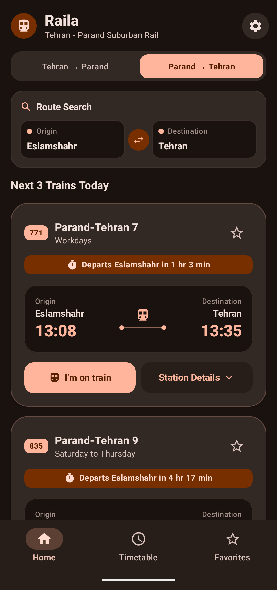
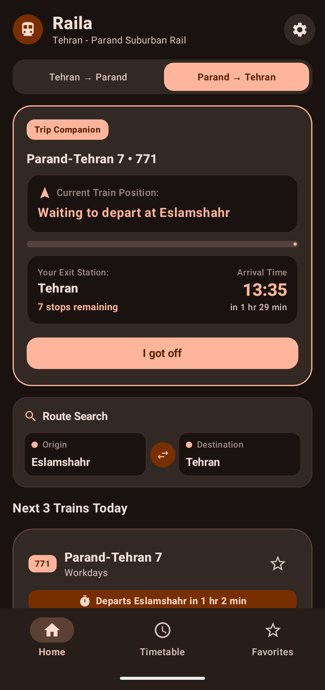
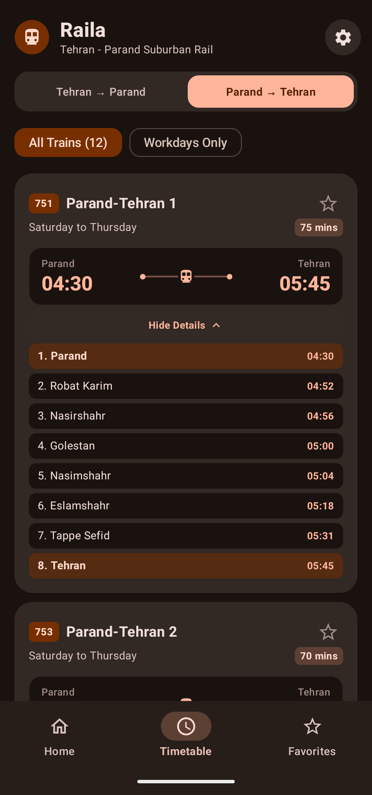
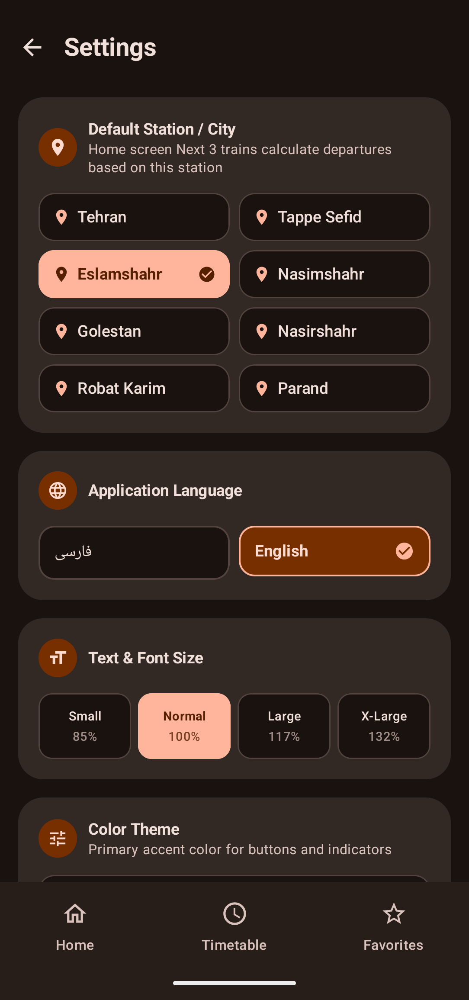
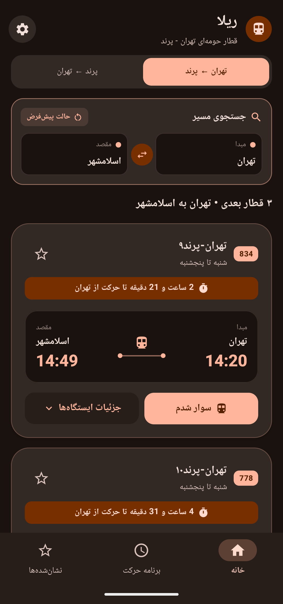
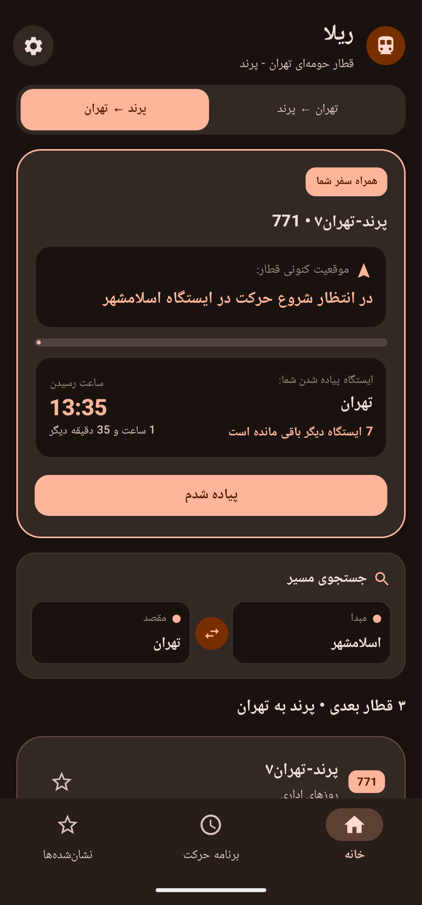
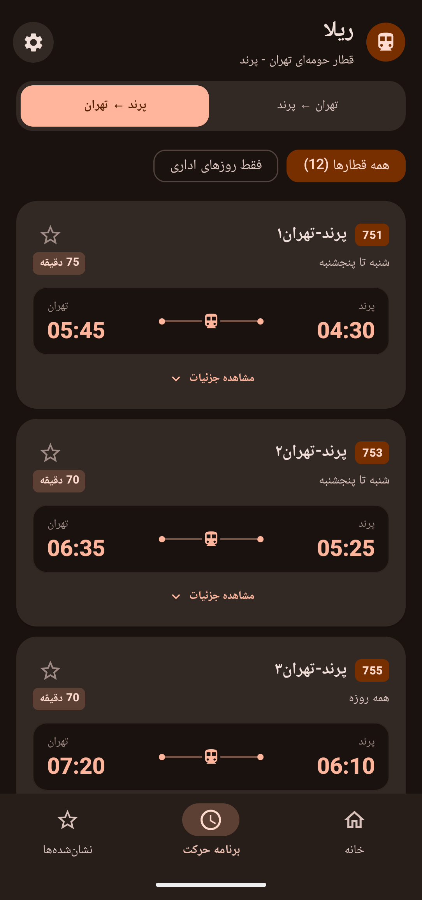
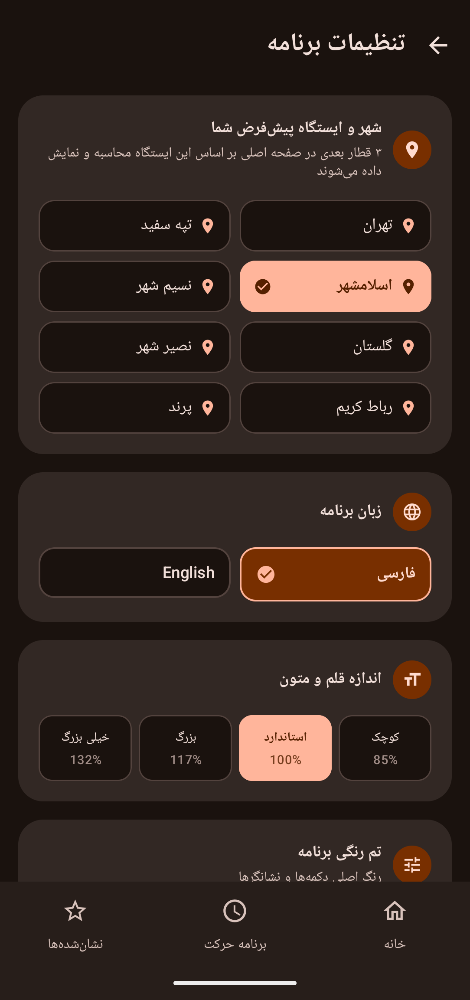

# Raila (ریلا) 🚆

  <b>Modern Suburban Train Schedule & Trip Companion for Tehran – Parand</b>

  
  
  
  

 
---

## English

Raila is an offline-first Android application designed to eliminate suburban commute confusion between Tehran and Parand. Built natively with **Jetpack Compose** following **Material 3 guidelines**, it offers real-time schedule filtering, dynamic commute tracking, and complete localization.

### Key Features
* **Smart Schedule Filtering:** Automatically detects current time and highlights upcoming departing trains.
* **Interactive Trip Companion:** Track remaining stations and commute duration in real time with the "Boarded" mode.
* **Bilingual Support:** Full RTL/LTR layout handling for Persian (Farsi) and English.
* **Offline-First:** Instant query performance without needing active data connectivity.
* **Personalized Settings:** Customizable default stations, font scaling, and dynamic dark themes.

### Screenshots

  
  
  
  

### Tech Stack
* **Language:** Kotlin
* **UI Toolkit:** Jetpack Compose (Material 3)
* **Architecture:** MVVM + Unidirectional Data Flow (UDF)
* **State Management:** StateFlow / ViewModel
* **Data Layer:** Local JSON / Kotlinx Serialization

### Disclaimer
This is an independent, personal, open-source project and is not affiliated with, endorsed by, or connected to the Islamic Republic of Iran Railways (RAI) or Raja Rail Transportation Company. All schedules are based on publicly available data. The developer assumes no responsibility for unexpected schedule changes, delays, cancellations, or damages resulting from the use of this app.

---

## فارسی

**ریلا (Raila)** یک اپلیکیشن مدرن و سبک اندرویدی برای مشاهده و رهگیری قطارهای حومه‌ای مسیر تهران - پرند و ایستگاه‌های بین‌راهی (رباط‌کریم، نصیرشهر، نسیم‌شهر، گلستان، اسلامشهر و...) است. این برنامه بر پایه طراحی Material 3 و با فریم‌ورک Jetpack Compose ساخته شده است تا مسافران بدون نیاز به فایل‌های گیج‌کننده عکس یا اینترنت، سریع‌ترین دسترسی را به برنامه قطارها داشته باشند.

### ویژگی‌های کلیدی
* **نمایش هوشمند قطارهای پیش‌رو:** تشخیص خودکار قطارهای بعدی بر اساس زمان روز بدون نیاز به جستجوی دستی کل جدول.
* **حالت «سوار شدم» (همراه سفر):** رهگیری لحظه‌ای ایستگاه‌های باقی‌مانده و زمان تخمینی پیاده‌شدن.
* **پشتیبانی کامل دو زبانه:** پیاده‌سازی مستقل برای هر دو زبان فارسی (راست‌چین) و انگلیسی (چپ‌چین).
* **کاملاً آفلاین:** عملکرد سریع و بدون نیاز به اینترنت، مناسب برای فضای ایستگاه‌ها و طول مسیر ریلی.
* **شخصی‌سازی گسترده:** انتخاب ایستگاه پیش‌فرض، تغییر سایز متن‌ها و مدیریت قطارهای نشان‌شده.

### اسکرین‌شات‌ها

  
  
  
  

### سلب مسئولیت و عدم وابستگی
این پروژه کاملاً مستقل، شخصی و متن‌باز است و هیچ‌گونه وابستگی، ارتباط رسمی یا همکاری با شرکت راه‌آهن جمهوری اسلامی ایران یا شرکت حمل و نقل ریلی رجا ندارد. ساعت‌ها و برنامه‌های نمایش داده شده صرفاً بر اساس اطلاعات عمومی منتشر شده است و توسعه‌دهنده هیچ‌گونه مسئولیتی در قبال تغییرات ناگهانی ساعت حرکت، لغو قطارها، تأخیرها یا خسارات احتمالی ناشی از استفاده از این برنامه بر عهده نمی‌گیرد.

---

## Download & Installation
You can download the latest APK directly from the [Releases](https://github.com/sajadrahimi-dev/raila/releases) section or visit the landing page:
🔗 **[sajadrahimi-dev.github.io/raila](https://sajadrahimi-dev.github.io/raila/)**

## License
Distributed under the MIT License. See `LICENSE` for more information.
